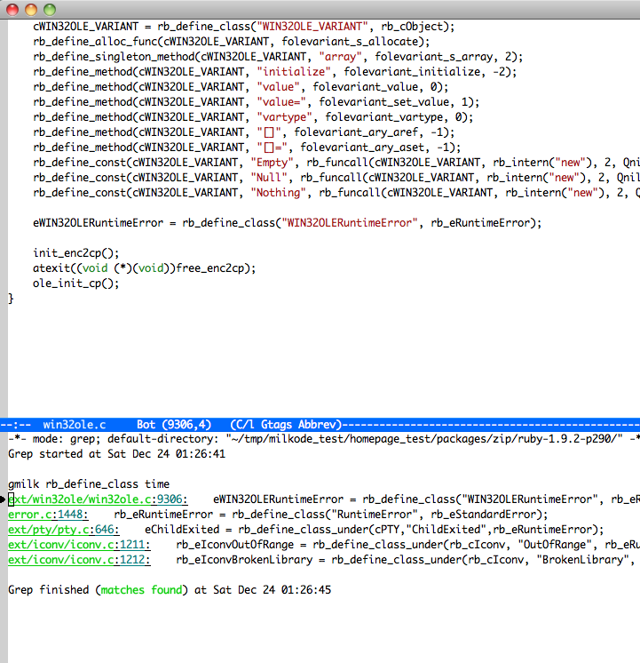

# Milkodeの特徴

- [大量のソースコードを素早く検索](#feature01)
- [行指向の検索ルーチン](#feature02)
- [簡単にインストール可能](#feature03)
- [gitライクなコマンドラインインターフェース](#feature04)
- [コマンドラインから検索](#feature05)
- [便利なwebアプリ](#feature06)

##  大量のソースコードを素早く検索
手元にある大量のソースコードを登録しておき、特定の一行を見つけることが出来ます。

レポジトリに20000ファイルのレコードが登録されていても、1秒以内に検索することが可能です。

##  行指向の検索ルーチン
Milkodeは行指向の検索エンジンです。

一般的に検索エンジンは「特定の単語を含むファイル」を見つけますがMilkodeは**「特定の単語を含む行」**を見つけます。 
例えば`def open`で検索すると一般的な検索エンジンでは

<pre>
def func()
.
.
open
.
.
</pre>

のようにファイル内に`def`と`open`が含まれるものを全て返しますが、Milkodeの場合は`def open_file()`, `def database_open()` といった1行の中に`def`, `open`が**含まれるものだけ**をピックアップしてくれます。

grepやエディタ附属のソースコード検索ツールは行指向のものが多いため、それらで培った検索テクニックがそのまま使えます。

##  簡単にインストール可能
Milkode本体はRubyで書かれており、Ruby(とRubyGems)が動く環境であればインストールすることが出来ます。利用しているライブラリも大半がPure Rubyで書かれたものです。

検索エンジンに採用したgroongaは特定のデータベースエンジンを必要としないため**MySQLやSQLite3といったソフトのインストールが不要**です。

##  gitライクなコマンドラインインターフェース
* データベースの作成(milk init)
* 検索対象の追加(milk add)
* 検索対象の更新(milk update)
* コマンドラインから検索(gmilk, milk grep)
* ウェブアプリの起動(milk web)

全て**milk**というコマンドから実行出来ます。

##  コマンドラインから検索

* grepのようにコマンドラインから検索出来ます。
* 数千、数万オーダーのファイルが登録されていても瞬時に目的の1行を見つけます。
* **パッケージ単位の検索**が出来ます。
  * パッケージ以下のどこにいてもルートディレクトルを基準として検索することが出来ます。
  * カレントディレクトリを意識しながら、grepの検索オプションを変えるような手間がなくなります。
* 豊富な絞り込みオプション(拡張子、ファイルパス、パッケージ名など)

##  便利なwebアプリ

* コードハイライト
 * ソースコードを見やすく色付けします
* 仮想ファイル、ディレクトリ
 * パッケージの中をファインダーやエクスプローラのように移動出来ます
 * 特定のディレクトリ以下から検索することも出来ます
* 絞り込みオプション(拡張子、ファイルパス、パッケージ名など)
* 複数行にまたがった検索

